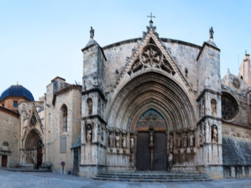
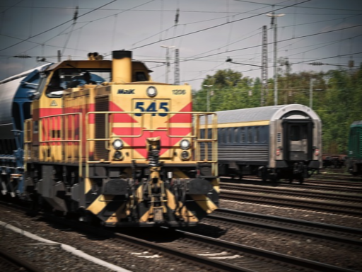
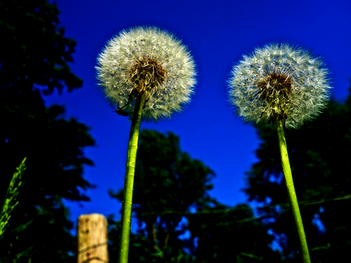
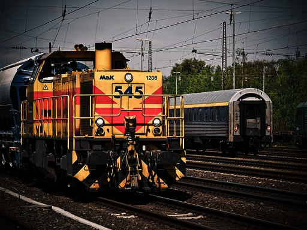
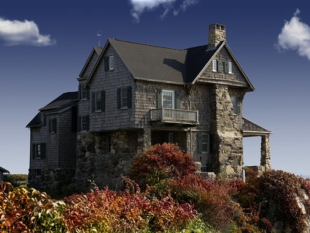
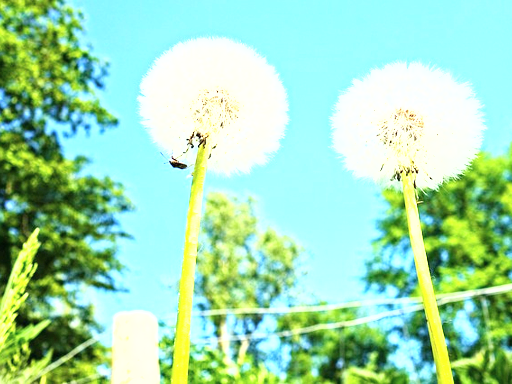
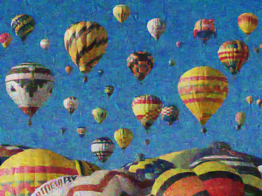
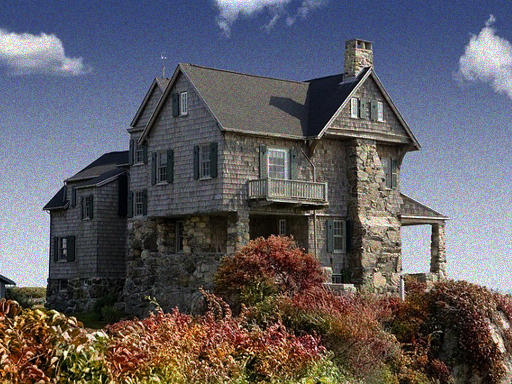
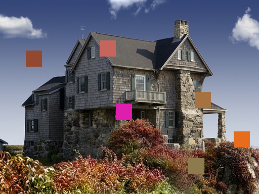
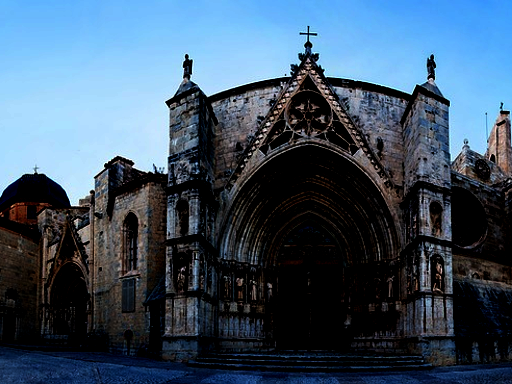

# Failure Cases (KADID-10k Test Split)

For each issue head, the 8 test images where the model's predicted probability was furthest from the true binary label (confident misses and confident false alarms both surface here). For quality_score, the 8 images with the largest absolute prediction error.

## blur

-  `I72_03_03.png` (dist: Motion blur lvl 3) -- true_label=1, predicted_prob=0.024
-  `I15_03_03.png` (dist: Motion blur lvl 3) -- true_label=1, predicted_prob=0.032
-  `I15_01_03.png` (dist: Gaussian blur lvl 3) -- true_label=1, predicted_prob=0.036
-  `I61_03_03.png` (dist: Motion blur lvl 3) -- true_label=1, predicted_prob=0.043
-  `I72_01_03.png` (dist: Gaussian blur lvl 3) -- true_label=1, predicted_prob=0.060
-  `I61_03_04.png` (dist: Motion blur lvl 4) -- true_label=1, predicted_prob=0.077
-  `I76_03_03.png` (dist: Motion blur lvl 3) -- true_label=1, predicted_prob=0.079
-  `I21_03_03.png` (dist: Motion blur lvl 3) -- true_label=1, predicted_prob=0.081

## underexposure

-  `I52_17_03.png` (dist: Darken lvl 3) -- true_label=1, predicted_prob=0.002
-  `I75_17_05.png` (dist: Darken lvl 5) -- true_label=1, predicted_prob=0.003
-  `I52_17_04.png` (dist: Darken lvl 4) -- true_label=1, predicted_prob=0.007
-  `I24_17_04.png` (dist: Darken lvl 4) -- true_label=1, predicted_prob=0.008
-  `I24_17_05.png` (dist: Darken lvl 5) -- true_label=1, predicted_prob=0.009
-  `I24_17_03.png` (dist: Darken lvl 3) -- true_label=1, predicted_prob=0.014
-  `I61_17_04.png` (dist: Darken lvl 4) -- true_label=1, predicted_prob=0.015
-  `I21_17_03.png` (dist: Darken lvl 3) -- true_label=1, predicted_prob=0.016

## overexposure

-  `I52_16_03.png` (dist: Brighten lvl 3) -- true_label=1, predicted_prob=0.003
-  `I52_16_04.png` (dist: Brighten lvl 4) -- true_label=1, predicted_prob=0.005
-  `I21_16_03.png` (dist: Brighten lvl 3) -- true_label=1, predicted_prob=0.012
-  `I24_16_05.png` (dist: Brighten lvl 5) -- true_label=1, predicted_prob=0.015
-  `I75_16_03.png` (dist: Brighten lvl 3) -- true_label=1, predicted_prob=0.023
-  `I52_16_05.png` (dist: Brighten lvl 5) -- true_label=1, predicted_prob=0.024
-  `I24_16_03.png` (dist: Brighten lvl 3) -- true_label=1, predicted_prob=0.031
-  `I61_16_03.png` (dist: Brighten lvl 3) -- true_label=1, predicted_prob=0.034

## noise

-  `I52_15_03.png` (dist: Denoise lvl 3) -- true_label=1, predicted_prob=0.034
-  `I52_15_04.png` (dist: Denoise lvl 4) -- true_label=1, predicted_prob=0.078
-  `I52_15_05.png` (dist: Denoise lvl 5) -- true_label=1, predicted_prob=0.088
-  `I21_14_03.png` (dist: Multiplicative noise lvl 3) -- true_label=1, predicted_prob=0.120
-  `I52_14_03.png` (dist: Multiplicative noise lvl 3) -- true_label=1, predicted_prob=0.129
-  `I52_11_03.png` (dist: White noise lvl 3) -- true_label=1, predicted_prob=0.130
-  `I21_13_03.png` (dist: Impulse noise lvl 3) -- true_label=1, predicted_prob=0.130
-  `I52_13_03.png` (dist: Impulse noise lvl 3) -- true_label=1, predicted_prob=0.132

## corruption

-  `I21_18_05.png` (dist: Mean shift lvl 5) -- true_label=1, predicted_prob=0.048
-  `I21_20_05.png` (dist: Non-eccentricity patch lvl 5) -- true_label=1, predicted_prob=0.054
-  `I72_25_05.png` (dist: Contrast change lvl 5) -- true_label=1, predicted_prob=0.077
-  `I21_23_03.png` (dist: Color block lvl 3) -- true_label=1, predicted_prob=0.091
-  `I21_10_03.png` (dist: JPEG lvl 3) -- true_label=1, predicted_prob=0.094
-  `I72_09_03.png` (dist: JPEG2000 lvl 3) -- true_label=1, predicted_prob=0.099
-  `I15_17_05.png` (dist: Darken lvl 5) -- true_label=1, predicted_prob=0.105
-  `I21_06_03.png` (dist: Color quantization lvl 3) -- true_label=1, predicted_prob=0.109

## quality_score

-  `I52.png` (dist: none lvl 0) -- true_quality=100.0, predicted_quality=6.8
-  `I52_18_02.png` (dist: Mean shift lvl 2) -- true_quality=95.8, predicted_quality=6.7
-  `I52_01_01.png` (dist: Gaussian blur lvl 1) -- true_quality=94.2, predicted_quality=6.8
-  `I52_03_01.png` (dist: Motion blur lvl 1) -- true_quality=92.5, predicted_quality=6.8
-  `I52_08_01.png` (dist: Color saturation 2 lvl 1) -- true_quality=92.5, predicted_quality=6.8
-  `I52_16_01.png` (dist: Brighten lvl 1) -- true_quality=91.8, predicted_quality=6.6
-  `I52_18_04.png` (dist: Mean shift lvl 4) -- true_quality=93.2, predicted_quality=8.1
-  `I52_17_02.png` (dist: Darken lvl 2) -- true_quality=92.5, predicted_quality=7.8
