# Failure Cases (KADID-10k Test Split)

For each issue head, the 8 test images where the model's predicted probability was furthest from the true binary label (confident misses and confident false alarms both surface here). For quality_score, the 8 images with the largest absolute prediction error.

## blur

-  `I76_03_03.png` (dist: Motion blur lvl 3) -- true_label=1, predicted_prob=0.016
-  `I72_03_03.png` (dist: Motion blur lvl 3) -- true_label=1, predicted_prob=0.029
-  `I75_03_03.png` (dist: Motion blur lvl 3) -- true_label=1, predicted_prob=0.032
- 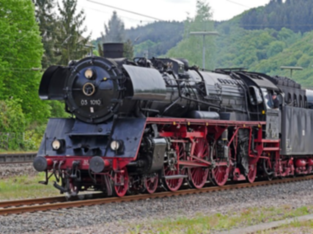 `I76_01_03.png` (dist: Gaussian blur lvl 3) -- true_label=1, predicted_prob=0.041
- 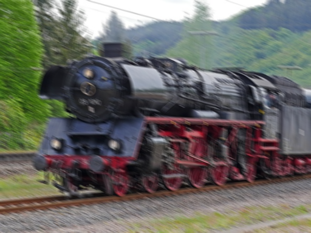 `I76_03_05.png` (dist: Motion blur lvl 5) -- true_label=1, predicted_prob=0.042
-  `I75_03_04.png` (dist: Motion blur lvl 4) -- true_label=1, predicted_prob=0.055
-  `I21_02_02.png` (dist: Lens blur lvl 2) -- true_label=0, predicted_prob=0.935
-  `I75_01_03.png` (dist: Gaussian blur lvl 3) -- true_label=1, predicted_prob=0.088

## underexposure

-  `I52_17_03.png` (dist: Darken lvl 3) -- true_label=1, predicted_prob=0.000
-  `I52_17_04.png` (dist: Darken lvl 4) -- true_label=1, predicted_prob=0.001
- 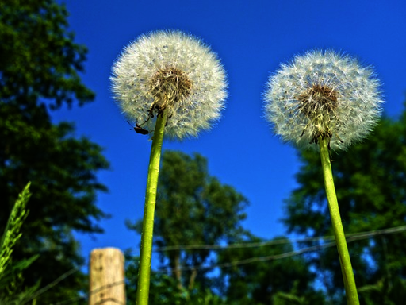 `I24_17_04.png` (dist: Darken lvl 4) -- true_label=1, predicted_prob=0.003
- 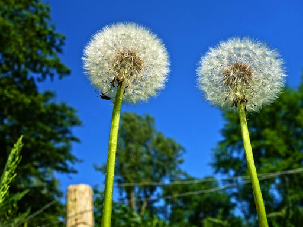 `I24_17_03.png` (dist: Darken lvl 3) -- true_label=1, predicted_prob=0.003
- 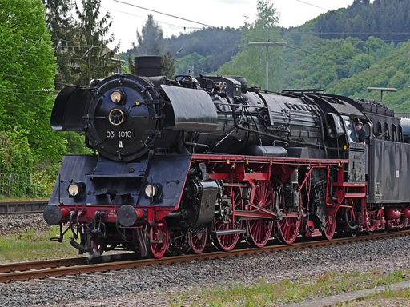 `I76_17_03.png` (dist: Darken lvl 3) -- true_label=1, predicted_prob=0.005
-  `I75_17_05.png` (dist: Darken lvl 5) -- true_label=1, predicted_prob=0.009
- 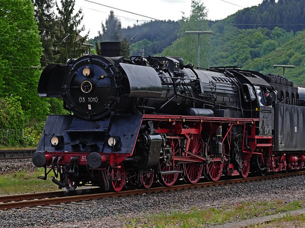 `I76_17_04.png` (dist: Darken lvl 4) -- true_label=1, predicted_prob=0.011
-  `I72_17_03.png` (dist: Darken lvl 3) -- true_label=1, predicted_prob=0.021

## overexposure

-  `I52_16_03.png` (dist: Brighten lvl 3) -- true_label=1, predicted_prob=0.000
-  `I52_16_04.png` (dist: Brighten lvl 4) -- true_label=1, predicted_prob=0.001
-  `I21_16_03.png` (dist: Brighten lvl 3) -- true_label=1, predicted_prob=0.016
- 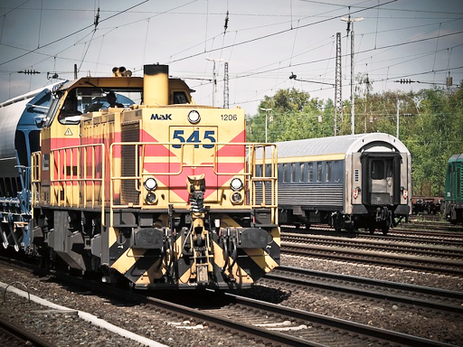 `I61_16_03.png` (dist: Brighten lvl 3) -- true_label=1, predicted_prob=0.019
- 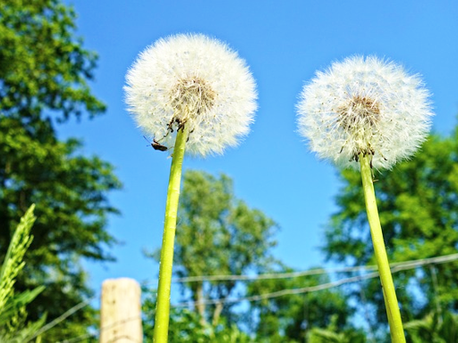 `I24_16_03.png` (dist: Brighten lvl 3) -- true_label=1, predicted_prob=0.021
-  `I75_16_03.png` (dist: Brighten lvl 3) -- true_label=1, predicted_prob=0.045
- 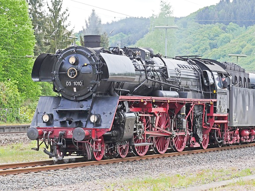 `I76_16_03.png` (dist: Brighten lvl 3) -- true_label=1, predicted_prob=0.049
- 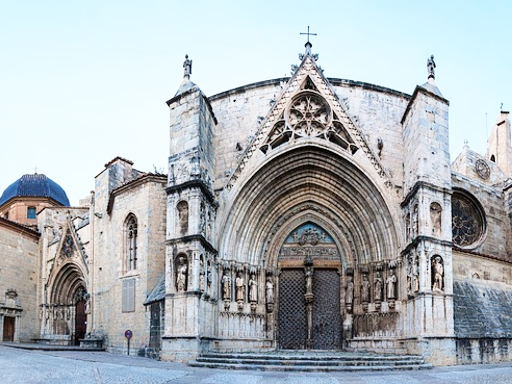 `I15_16_03.png` (dist: Brighten lvl 3) -- true_label=1, predicted_prob=0.069

## noise

- 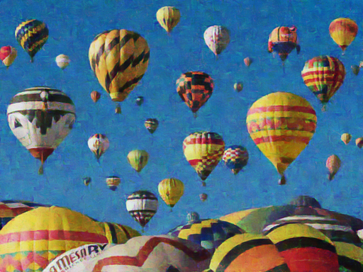 `I52_15_03.png` (dist: Denoise lvl 3) -- true_label=1, predicted_prob=0.001
- 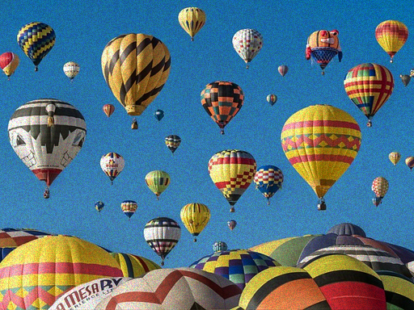 `I52_14_03.png` (dist: Multiplicative noise lvl 3) -- true_label=1, predicted_prob=0.001
- 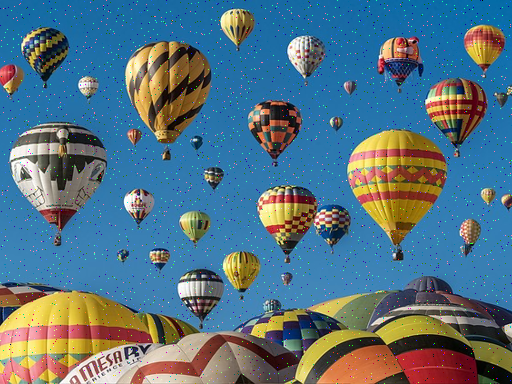 `I52_13_03.png` (dist: Impulse noise lvl 3) -- true_label=1, predicted_prob=0.001
- 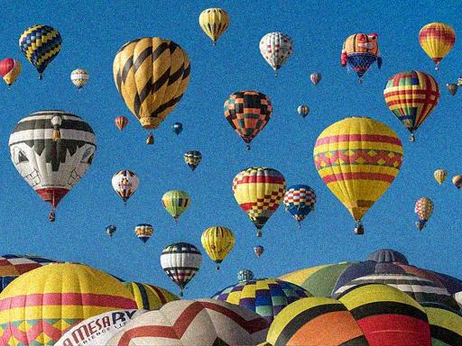 `I52_11_03.png` (dist: White noise lvl 3) -- true_label=1, predicted_prob=0.002
-  `I52_12_03.png` (dist: White noise in color component lvl 3) -- true_label=1, predicted_prob=0.005
-  `I52_11_04.png` (dist: White noise lvl 4) -- true_label=1, predicted_prob=0.006
- 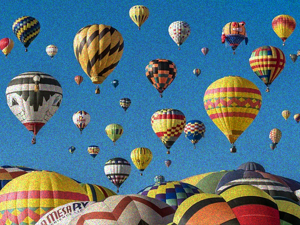 `I52_14_04.png` (dist: Multiplicative noise lvl 4) -- true_label=1, predicted_prob=0.006
-  `I52_14_05.png` (dist: Multiplicative noise lvl 5) -- true_label=1, predicted_prob=0.012

## corruption

-  `I21_20_05.png` (dist: Non-eccentricity patch lvl 5) -- true_label=1, predicted_prob=0.040
-  `I21_18_05.png` (dist: Mean shift lvl 5) -- true_label=1, predicted_prob=0.056
- 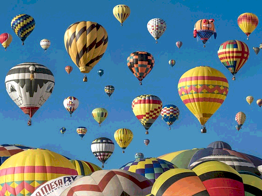 `I52_22_03.png` (dist: Quantization lvl 3) -- true_label=0, predicted_prob=0.943
-  `I52_22_01.png` (dist: Quantization lvl 1) -- true_label=0, predicted_prob=0.932
-  `I52_22_04.png` (dist: Quantization lvl 4) -- true_label=0, predicted_prob=0.930
-  `I21_06_03.png` (dist: Color quantization lvl 3) -- true_label=1, predicted_prob=0.072
-  `I52_09_02.png` (dist: JPEG2000 lvl 2) -- true_label=0, predicted_prob=0.927
-  `I52_08_03.png` (dist: Color saturation 2 lvl 3) -- true_label=0, predicted_prob=0.925

## quality_score

-  `I52.png` (dist: none lvl 0) -- true_quality=100.0, predicted_quality=4.2
-  `I52_18_02.png` (dist: Mean shift lvl 2) -- true_quality=95.8, predicted_quality=3.6
-  `I52_01_01.png` (dist: Gaussian blur lvl 1) -- true_quality=94.2, predicted_quality=4.2
-  `I52_18_04.png` (dist: Mean shift lvl 4) -- true_quality=93.2, predicted_quality=4.9
-  `I52_03_01.png` (dist: Motion blur lvl 1) -- true_quality=92.5, predicted_quality=4.2
-  `I52_08_01.png` (dist: Color saturation 2 lvl 1) -- true_quality=92.5, predicted_quality=4.2
-  `I52_16_01.png` (dist: Brighten lvl 1) -- true_quality=91.8, predicted_quality=3.8
-  `I52_18_01.png` (dist: Mean shift lvl 1) -- true_quality=90.8, predicted_quality=3.1
